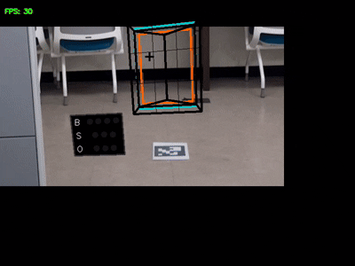
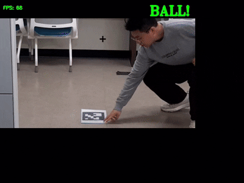
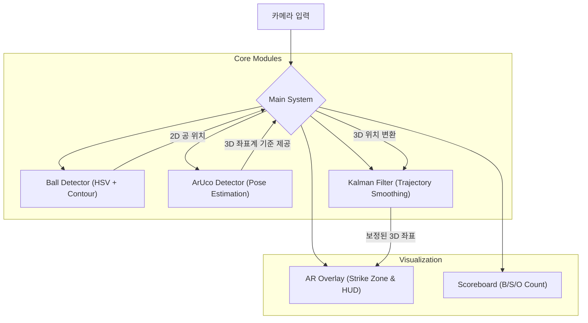

# AR Strike Zone: 증강현실 야구 투구 분석 시스템

[](https://www.python.org/)
[](https://opencv.org/)

**AR Strike Zone**은 단일 카메라를 사용하여 실시간으로 투구 궤적을 추적하고, 스트라이크 존을 증강현실(AR)로 시각화하며, 투구 데이터를 심층 분석하는 시스템입니다.



---

## 📌 주요 기능

1.  **실시간 AR 스트라이크 존**: ArUco 마커를 기준으로 3D 공간에 스트라이크/볼 존 시각화.
2.  **공 추적 및 구속 측정**: HSV 기반 공 검출과 칼만 필터를 이용한 정밀 추적 및 구속(km/h) 계산.
3.  **자동 판정**: 공의 3D 궤적을 분석하여 스트라이크/볼 자동 판정.
4.  **AR 전광판**: 실시간 볼카운트(B/S/O) 디스플레이.

### 시연 영상 및 스크린샷

<div align="center">
  <h4>AR 판정 및 효과</h4>
  
  
  
</div>
<br/>
<div align="center">
  <h4>실험 및 테스트</h4>
  
  
</div>
<br/>
<div align="center">
  <h4>시스템 구성 요소</h4>
  
  
  
</div>

---

## 🏗️ 시스템 아키텍처



---

## 🛠️ 기술적 원리

### 1. 좌표계 설정 (ArUco Marker)

단일 카메라 환경에서 깊이(Depth)를 추정하기 위해 ArUco 마커를 사용합니다. 마커의 실제 크기를 바탕으로 카메라와 현실 공간 사이의 **3D Pose(Rotation, Translation)**를 계산하여 기준 좌표계를 생성합니다.

### 2. 공 검출 (HSV & Pinhole)

- **검출**: HSV 색상 공간에서 공의 색상을 추출.
- **거리 계산**: 핀홀 카메라 모델을 응용, 이미지 상의 공 크기와 실제 크기의 비율로 거리(Z축) 추정.

### 3. 정밀 추적 (Kalman Filter)

카메라 노이즈와 검출 오차를 줄이고, 공이 잠시 가려져도 끊김 없는 궤적을 그리기 위해 **칼만 필터**를 적용했습니다.

---

## 🚀 실행 방법

### 요구 사항

- Python 3.9 이상
- 웹캠 (시스템에 연결되어 있어야 함)

### 설치 및 실행

1. **저장소 클론 및 이동**

   ```bash
   git clone https://github.com/YUjinEDU/Strikezone.git
   cd AR_StrikeZone/src_v1
   ```

2. **의존성 라이브러리 설치**
   `requirements.txt` 파일을 이용하여 필요한 라이브러리를 한 번에 설치합니다.

   ```bash
   pip install -r requirements.txt
   ```

3. **카메라 연결 확인**

   - PC에 웹캠이 정상적으로 연결되어 있는지 확인합니다.
   - 노트북의 경우 내장 웹캠을 사용할 수 있습니다.

4. **프로그램 실행 (GUI)**
   사용자 친화적인 인터페이스를 제공하는 `main_gui.py`를 실행합니다.

   ```bash
   python main_gui.py
   ```

   > **참고**: 실행 후 "Camera" 버튼을 클릭하여 연결된 카메라를 선택하고, 화면에 ArUco 마커가 보이도록 배치하세요.

---

## 📂 파일 구조 (src_v1)

- `main_gui.py`: **[메인]** PyQt5 기반의 통합 GUI 실행 파일.
- `main_v7.py`: (레거시) 콘솔 기반 실행 파일.
- `aruco_detector.py`: 마커 검출 및 좌표계 변환.
- `tracker_v1.py`: 공 색상 검출.
- `kalman_filter.py`: 궤적 보정.
- `baseball_scoreboard.py`: AR 전광판.
- `requirements.txt`: 프로젝트 의존성 목록.
