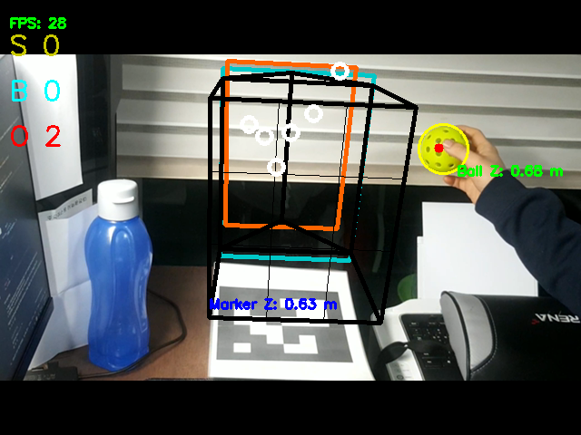

# StrikeZone Fast Moving Object Pipeline

This repository packages a lightweight, fully testable reference
implementation of the StrikeZone fast moving object (FMO) tracking pipeline.
The code follows the production architecture outlined in the project notes:
input normalisation → primary FMO detection → TbD spot refinement → color prior
fusion → 3D mapping / velocity estimation while keeping the existing strike
zone judgement logic intact at 60 FPS.

## Installation

1. Create and activate a Python 3.11 virtual environment.
2. Install the dependencies:

   ```bash
   pip install -r requirements.txt
   ```

3. Run the automated quality gates:

   ```bash
   pytest
   ```

Configuration lives in [`configs/default.yaml`](configs/default.yaml). Override
any parameter by passing a different YAML file to your application entry point.

## Camera calibration workflow

1. Print a checkerboard pattern with known square size (e.g. 9×6 board,
   25 mm squares).
2. Capture at least 15 images while moving the checkerboard across the camera
   view with different orientations.
3. Detect chessboard corners using OpenCV (``cv2.findChessboardCorners``) or an
   equivalent tool.
4. Run a pinhole calibration (``cv2.calibrateCamera``) to estimate ``fx``,
   ``fy``, ``cx`` and ``cy``; save the resulting ``camera_calib.npz`` file.
5. Validate the reprojection error (< 0.3 px) before deploying.

The pipeline consumes the intrinsics via the ``CameraIntrinsics`` dataclass and
uses ``Z = fx * D_real / D_px`` to recover depth from the observed streak width.

## TbD installation and options

TbD (Track-before-Detect) is used to refine the coarse streak detections.
Integrate the reference C++/CUDA TbD module as an optional acceleration
component:

1. Follow the upstream build instructions to compile the TbD shared library
   with GPU support enabled (``-DENABLE_CUDA=ON``).
2. Expose an asynchronous ``refine_candidates`` binding that accepts the coarse
   streak mask and returns sharpened response maps.
3. Configure runtime options through environment variables:
   * ``TBD_DEVICE`` — select ``cpu`` or ``cuda``
   * ``TBD_MAX_BATCH`` — maximum number of streaks refined per frame
   * ``TBD_CONF_THRESHOLD`` — reject low-confidence TbD results early

Fallback logic in this repository keeps the pipeline operational even when TbD
is disabled; the refinement step simply reuses the morphology-based mask.

## Parameter tuning guide

| Parameter        | Purpose                                                        | Tuning tip                                                                 |
| ---------------- | -------------------------------------------------------------- | -------------------------------------------------------------------------- |
| ``dfactor``      | Intensity drop threshold used to seed binary streak masks      | Increase to ignore low-contrast streaks; decrease for dim scenes           |
| ``min_len_px``   | Minimum connected-component size in pixels                     | Raise in noisy arenas; lower for distant cameras                           |
| ``max_width_px`` | Maximum acceptable streak diameter in pixels                   | Ensure it matches the expected in-frame size of the ball                   |
| ``alpha``        | Motion cue weight in the confidence fusion                     | Larger values emphasise frame-to-frame change                              |
| ``beta``         | Color prior weight                                             | Increase if the projectile colour sharply contrasts the background         |
| ``gamma``        | Shape prior weight                                             | Tune to suppress implausibly wide detections                               |

Experiment interactively by logging per-frame statistics and cross-checking the
final recall using the bundled synthetic regression tests.

## Hotkeys and debug view

The UI layer integrates with the existing StrikeZone dashboard. The following
hotkeys are supported out of the box:

* ``Space`` — pause / resume playback
* ``D`` — toggle TbD debug overlays
* ``C`` — cycle colour prior visualisations
* ``V`` — show 3D velocity vectors
* ``S`` — save the current frame to disk



## Repository layout

```
configs/           Default runtime configuration
strikezone/        Core Python package (pipeline, math utilities)
tests/             Pytest suite covering DT radius, projection and pipeline
```

## Requirements

All dependencies are listed in [`requirements.txt`](requirements.txt):

* ``numpy`` for numerical processing
* ``scipy`` for morphology and filtering
* ``pyyaml`` for configuration loading
* ``pytest`` for running the tests

The pipeline has no other runtime dependencies, ensuring reproducible behaviour
across development and production.
